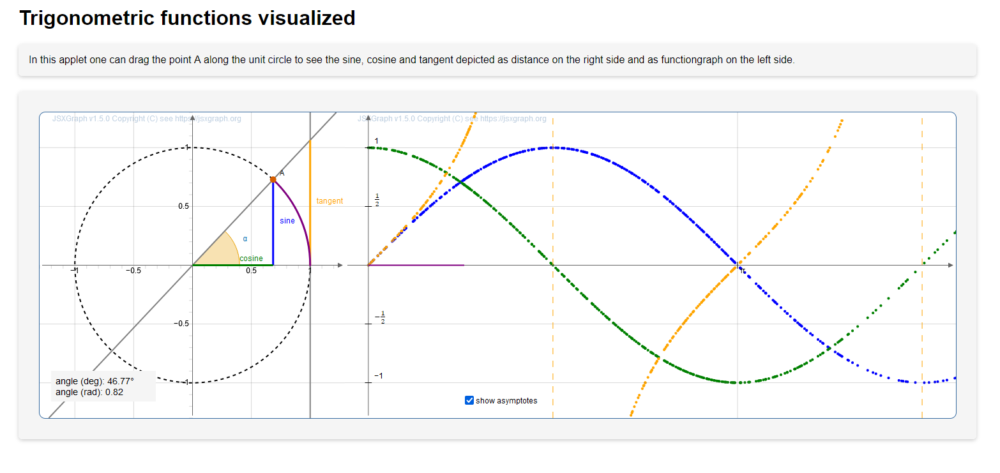

# Applet trigonometric functions

This is an applet built with JSXGraph showing the trigonometric functions.

In this applet one can drag the point A along the unit circle to see the sine, cosine and tangent depicted as distance on the right side and as functiongraph on the left side. 

